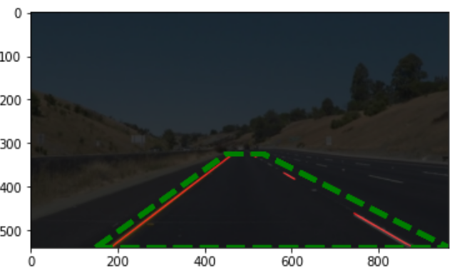
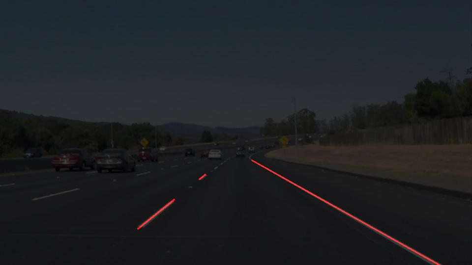

# **Finding Lane Lines on the Road** 

# Goals
The goals / steps of this project are the following:
* Make a pipeline that finds lane lines on the road
* Reflect on your work in a written report

---

## Pipeline
### General pipeline
1. Convert the image to grayscale in order to extract features.
2. Blur the image using Gaussian smoothing. I used a kernel size 5.
3. Perform Canny edge detection on the blurred image (it makes it easier to detect edges).\
4. Define a region of interest where we expect the lines to be. I did this by trial and error. An example is shown in the image below where the polygon is in green.
5. This region is then used to mask off unwanted edges/features.
6. A Hough transform is then implemented on the output of Canny edge detector *within the region of interest* that we defined using the polygons.
7. Finally, the detected lines are drawn on the image.

 

### Improving the `draw_lines()` function
The general idea is to classify detected points into either a left or right line. This is done by computing the slope between two points using $m = \frac{y_{2}-y_{1}}{x_{2}-x_{1}}$ and then classifying the line as it belongs to left/right lane by checking if $m$ is positive or negative. 

These points are then used to fit a line into them using `polyfit`. However, I was not able to output the results due to technical issues (sometimes the image wouldn't have any features so an error pops). So instead, I decided to do the following. After computing the slope and intersection of each lane/line, I would plot the $(x, f(x))$ points, where $f(x) = m x + b$ is the line function. This, way the output contains *points* along the computed line. 

The image below shows the results. The lines are straight and do not curve. 

 

However, this approach would have a drawback as it assumes that the curves are straight lines which is not always the case (e.g., when taking a turn).

## Reflection

### 1. Possible shortcomings of my approach and possible solutions

1. The region of interest where points are detected is currently pre-defined by the user. However, we may run into issues when the lines are out the region. This can happen when the car if far to the left/right of the road. In such case, the algorithm would miss one of the lanes.  
One way to improve on this is to dynamically change the search region of the two lines are not detected (not any two lines, but two lines that are "almost parallel" to each other). 

2. Another issue is in outlier rejection. When computing the lines, we are considering every point to find the best-fit line. However, there may be outliers that would drift off the solution. One possible way around this is to run a RANSAC algorithm or some other outlier-rejection algorithm before fitting lines. 
3. In my modified `draw_lines()` function, I assumed that the lines are always straight, thus fitting a first-order polynomial to the data. However, that may not always be the case (e.g., on a turn, the lines are not straight). There are different ways around this. We can assume that the lines take a form of a polynomial (this is reasonable as the lines do not change abruptly) and I would think a quadratic polynomial will be improve the results dramatically (it would make it harder to classify though). Another way to do it is perhaps just rejecting outliners and fitting any high-order polynomial to the points.

## 2. Suggest possible improvements to your pipeline

The first possible improvement is fixing the line-fitting function. Ideally, I would like to have to lines of the same length, one on either sides of the road, that would track the lanes. My approach is not far off from that, I just need to specify an $(x_{1},y_{1})$ and $(x_{2},y_{2})$ points and plot a line that goes through them.

Other improvements is fitting a higher-order polynomial to the points. 
